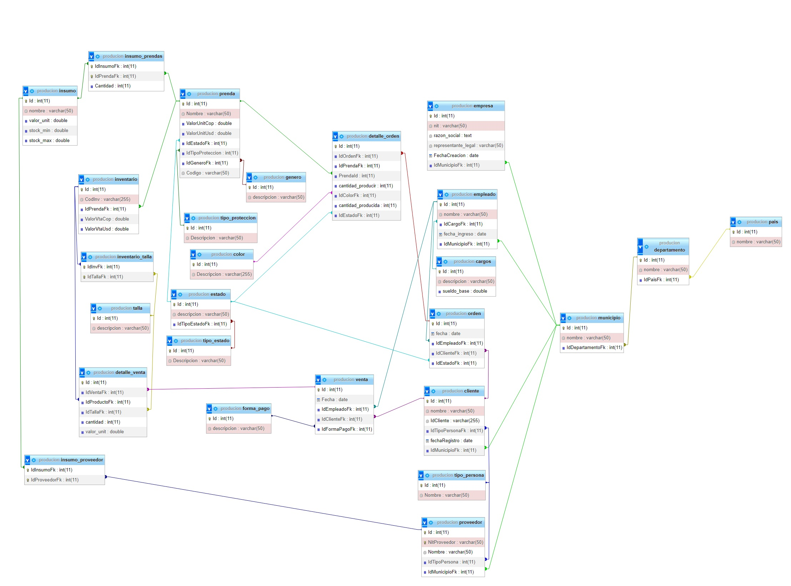

# Backend Vizyon
## Descripcion
"Vizyon Industrial, una empresa especializada en la producción de prendas de seguridad industrial, busca mejorar su eficiencia operativa mediante el desarrollo de un sistema de Backend que integre varias aplicaciones Frontend desarrolladas por una consultora externa. Como especialista en Desarrollo de Software, se te encomienda la tarea de diseñar y construir los Endpoints del Backend.

## Objectivo
El objetivo principal es establecer una comunicación efectiva entre las aplicaciones Frontend y la base de datos, utilizando un diseño base proporcionado por Vizyon Industrial. Este diseño base de la base de datos es obligatorio para el desarrollo del proyecto.

## Diagrama Entidad Relacion

**1. Listar todas las ventas que se reali#zaron en el mes de julio de 2023**

**2. Seleccionar todos los empleados con sus respectivos cargos y municipios**

**3. Obtener la lista de todas las ventas con la información de los clientes y la forma de pago**

**4. Mostrar los detalles de todas las órdenes junto con los nombres de los empleados y clientes asociados**

**5. Listar los productos disponibles en el inventario junto con su talla y color**

**6. Mostrar todos los proveedores junto con la lista de insumos que suminis**

**7. Encontrar la cantidad de ventas realizadas por cada empleado**

**8. Mostrar la lista de órdenes en proceso junto con los nombres de los clientes y empleados asociados**

**9. Obtener el nombre de la empresa y su respectivo representante legal junto con el nombre del municipio al que pertenecen**

**10. Mostrar la lista de prendas y su respectivo stock disponible**

**11. Encontrar el nombre de los clientes que realizaron compras en una fecha específica junto con la cantidad de artículos comprados**

**12. Mostrar la lista de empleados y la duración de su empleo en años**

**13. Obtener el nombre de las prendas junto con el valor total de ventas en dólares para cada una**

**14. Obtener el nombre de las prendas junto con la cantidad mínima y máxima de insumos necesarios para su fabricación**

**15. Obtener la lista de empleados y su información de contacto, incluyendo el nombre, el cargo y el municipio**

**16. Mostrar la lista de ventas realizadas en un rango de fechas específico junto con el nombre del cliente y la forma de pago**

**17. Obtener el nombre de las prendas y su valor unitario en dólares junto con el estado de disponibilidad**

**18. Mostrar la lista de clientes y la cantidad de compras que han realizado**

**19. Obtener la lista de órdenes junto con el estado actual y la fecha en que se crearon**

**20. Obtener el nombre y la descripción de los cargos con un sueldo base superior a 2.000.000**

**21. Mostrar la lista de clientes con sus respectivos municipios y países**

**22 Obtener el nombre y la descripción de los tipos de protección y el número de prendas asociadas a cada tipo**

**23 Mostrar la lista de empleados con sus cargos y fechas de ingreso ordenados por la fecha de ingreso de manera descendente**

**24 Mostrar el nombre y la descripción de todos los cargos junto con la cantidad de empleados en cada cargo**

**25 Obtener el nombre y la descripción de los estados junto con la cantidad de prendas asociadas a cada estado**

**26 Obtener el nombre y la descripción de los tipos de persona junto con la cantidad de clientes asociados a cada tipo**

**27 Mostrar el nombre y la descripción de los tipos de protección junto con la cantidad de prendas asociadas a cada tipo**

**28 Obtener el nombre y la descripción de los estados junto con la cantidad de órdenes asociadas a cada estado**

**29 Obtener el nombre y la descripción de los tipos de pago junto con la cantidad de ventas asociadas a cada tipo**

**30 Mostrar el nombre y la descripción de los tipos de insumos junto con la cantidad de prendas que los utilizan**

**31 Obtener el nombre de los clientes y la cantidad total gastada por cada uno en ventas**

**32 Mostrar el nombre y la descripción de las prendas junto con el valor total de ventas en pesos colombianos para cada una**

**33 Mostrar el nombre y la descripción de los estados junto con la cantidad de prendas asociadas a cada estado en orden ascendente de la cantidad de prendas**

